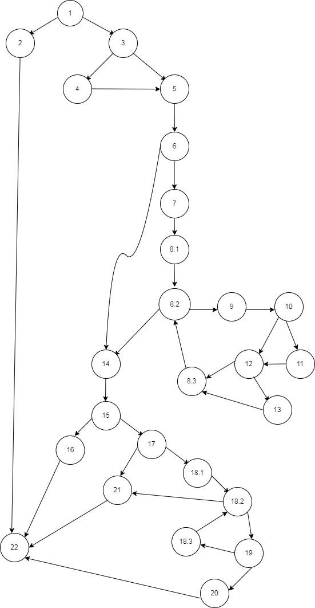

# Втора лабораториска вежба по Софтверско инженерство

## Адријан Стојановски, бр. на индекс 173099

###  Control Flow Graph

### Цикломатска комплексност

Цикломатската комплексност на овој код е 11.
V(G) = E – V + 2
V(G) = P + 1
Буквата Е означува број на рабовите кои ги поврзуваат јазлите или таканаречени трансфери на контрола, ги имаме 35. Буквата N означува број на јазли во графот, во овој граф изнесуваат 26. Буквата P означува број делови од каде што програмата ни паѓа или завршува. Такви ги имаме 10.

### Тест случаи според критериумот Multiple Condition

Според Multiple Condition критериумот за условот `if (user==null || user.getPassword()==null || user.getEmail()==null)`, имаме три услови кои треба да ги провериме:

1. Услов 1: `user == null`
2. Услов 2: `user.getPassword() == null`
3. Услов 3: `user.getEmail() == null`

За да ги покриеме сите можни комбинации на овие услови, можеме да ги дефинираме следните тест случаи:

#### Тест случај 1:
- Влезни податоци: `user = null`
- Очекуван излез: RuntimeException("Mandatory information missing!")
- Објаснување: Овој тест случај проверува дали функцијата ќе фрли исклучок кога `user` е `null`.

#### Тест случај 2:
- Влезни податоци: `user = User("username", null, "email")`
- Очекуван излез: RuntimeException("Mandatory information missing!")
- Објаснување: Овој тест случај проверува дали функцијата ќе фрли исклучок кога `user.getPassword()` е `null`.

#### Тест случај 3:
- Влезни податоци: `user = User("username", "password", null)`
- Очекуван излез: RuntimeException("Mandatory information missing!")
- Објаснување: Овој тест случај проверува дали функцијата ќе фрли исклучок кога `user.getEmail()` е `null`.

#### Тест случај 4:
- Влезни податоци: `user = User("username", null, null)`
- Очекуван излез: RuntimeException("Mandatory information missing!")
- Објаснување: Овој тест случај проверува дали функцијата ќе фрли исклучок кога `user.getPassword()` и `user.getEmail()` се `null`.

#### Тест случај 5:
- Влезни податоци: `user = User(null, "password", "email")`
- Очекуван излез: RuntimeException("Mandatory information missing!")
- Објаснување: Овој тест случај проверува дали функцијата ќе фрли исклучок кога `user` има `null` во `user.getUsername()`.

#### Тест случај 6:
- Влезни податоци: `user = User("username", "password", "email")`
- Очекуван излез: Нема да се фрли исклучок
- Објаснување: Овој тест случај проверува дали функцијата ќе изврши успешно